# AI Guide 智慧景区导览系统总体设计说明书

> 版本：v2.2  
> 更新日期：2026-07-20  
> 适用范围：AI Guide 智慧景区导览系统的产品说明、总体方案、功能实现、数据模型与测试说明  
> 演示场景：灵山胜境景区  
> 文档定位：面向项目评审、开发实现、测试验收和后续维护的整体性介绍文档

## 目录

1. [产品简要介绍](#1-产品简要介绍)
2. [产品定位与使用人群](#2-产品定位与使用人群)
3. [需求分析](#3-需求分析)
4. [功能设计](#4-功能设计)
5. [总体方案设计](#5-总体方案设计)
6. [数据库模型设计](#6-数据库模型设计)
7. [前后端框架设计](#7-前后端框架设计)
8. [核心算法与 AI 交互设计](#8-核心算法与-ai-交互设计)
9. [安全与权限设计](#9-安全与权限设计)
10. [测试说明](#10-测试说明)
11. [部署与运维说明](#11-部署与运维说明)

---

## 1. 产品简要介绍

### 1.1 产品概述

AI Guide 是一套面向景区场景的智慧导览系统。系统以游客真实游览过程为主线，将景区中常见的“查询信息、理解景点、规划路线、导航前往、查看票务、参与活动、提交反馈”等行为整合到统一的移动端应用中，同时提供面向运营人员的管理后台，用于维护景区知识、FAQ、景点资料、票务活动、数字人配置、权限账号、系统日志和运营统计数据。与传统景点展示系统相比，AI Guide 更强调“服务链路的连贯性”：游客不是在多个孤立页面中查找信息，而是可以从一个问题、一个景点或一个路线需求自然进入完整的服务流程。

本项目以灵山胜境景区为演示场景，但整体设计并不局限于单一景点。系统中的景点、票务、活动、FAQ、知识库、路线历史和游客反馈都采用结构化数据维护方式，因此后续可以通过补充数据和调整配置扩展到其他景区。项目的核心价值不在于简单地增加一个 AI 聊天入口，而是在景区原有服务体系之上加入 AI 问答、RAG 检索、路线规划、个性化推荐和数据分析能力，使游客端体验和运营端管理形成闭环。

系统由游客端、管理端、后端服务、数据库和外部能力接入五部分组成。游客端负责向普通游客提供导览服务，管理端负责让景区运营人员维护内容和查看数据，后端服务承担业务接口、数据持久化、权限校验、AI 调度和地图服务封装，数据库保存所有业务内容和行为记录，外部能力主要包括大语言模型、高德地图、TTS/ASR、Embedding 模型等。系统设计时充分考虑了外部服务不稳定的问题，因此在 AI、地图和语音能力不可用时，仍保留关键词检索、直线距离估算、文本展示等降级逻辑，保证核心流程可继续使用。

### 1.2 建设目标

AI Guide 的建设目标可以概括为“提升游客体验、降低运营成本、沉淀业务数据、增强服务智能化”。对于游客而言，系统希望解决在景区中经常出现的几个问题：不知道哪些景点值得去，不清楚景点背后的文化含义，不知道如何安排路线，不知道附近有什么服务，也不知道从当前位置怎么走到目标地点。对于景区运营方而言，系统希望将原本分散在宣传资料、人工咨询、公众号文章和线下告示中的信息集中管理，并通过游客行为、路线使用、问答内容和反馈数据反向指导运营优化。

从技术目标看，系统需要同时满足内容管理、移动端体验、AI 问答、地图导航和数据分析等多种能力。为了避免各能力之间互相耦合，项目采用前后端分离和服务分层的方式组织代码。游客端和管理端不直接访问数据库，而是通过统一接口获取数据；AI 问答不直接使用原始知识文本，而是先经过分块、检索和重排；路线规划不依赖固定模板，而是综合景点标签、官方顺序、距离、停留时长和用户偏好进行计算。这样的设计使系统既能满足当前演示场景，也具备后续迭代和功能扩展的空间。

### 1.3 产品功能总览

下图展示了系统的核心组成。游客端偏向服务体验，管理端偏向内容与运营，AI 与算法能力作为中间层支撑问答、推荐和路线规划，数据与运维能力则为系统持续运行提供基础。

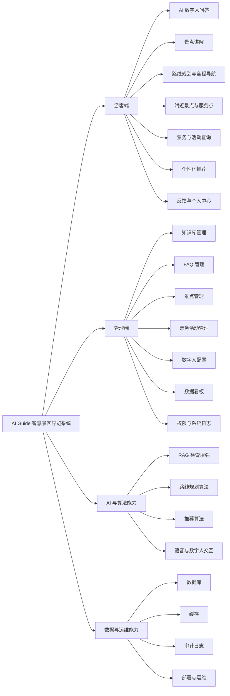

---

## 2. 产品定位与使用人群

### 2.1 产品定位

AI Guide 定位为景区智慧化升级中的“游客服务与运营管理一体化平台”。它并不只是面向游客的查询工具，也不是只面向后台人员的内容系统，而是在游客端和管理端之间建立数据闭环。游客端产生的对话、路线、反馈和行为会进入数据库，成为管理端统计分析、满意度报告和营销建议的来源；管理端维护的知识库、FAQ、景点、票务、活动和数字人配置又会反向影响游客端展示和 AI 问答结果。

这种定位决定了系统的设计重点不是“堆叠功能入口”，而是让各功能之间建立关系。例如，景点管理不仅影响景点详情页，还影响附近景点展示、路线规划算法、RAG 问答知识源和推荐算法；游客反馈不仅显示在反馈历史中，还进入满意度统计和低分反馈分析；路线规划不仅生成当前行程，还写入路线历史，成为热门路线统计和用户偏好画像的来源。通过这种方式，系统将游客侧体验和运营侧管理连接起来。

### 2.2 使用人群分析

游客端主要面向普通景区游客。首次到访游客往往对景区空间结构和景点价值缺乏了解，因此最需要的是快速入门式服务：有哪些必游景点、路线怎么走、需要花多久。文化兴趣游客更关注讲解内容，希望获得景点历史、建筑特点、宗教文化和故事背景，因此景点详情、语音讲解和 RAG 问答对这类用户更有价值。家庭或亲子游客通常对路线强度、休息点和活动安排更敏感，因此路线规划需要支持轻松路线和服务点提示。短时游览游客则更关注效率，希望系统在有限时间内帮助其优先访问核心景点。

管理端使用人群相对固定，主要包括系统管理员、内容运营人员、数字人运营人员和数据分析人员。系统管理员关注账号安全、权限策略和审计日志；内容运营人员关注知识库、FAQ、景点、票务和活动是否能够便捷维护；数字人运营人员关注模型资源、音色、服装和发布回滚；数据分析人员关注游客关注点、满意度、路线偏好、热门问答和消费结构。系统通过 RBAC 权限模型将不同角色的可访问功能区分开，使后台功能既能协作又能控制风险。

### 2.3 用户与功能关系

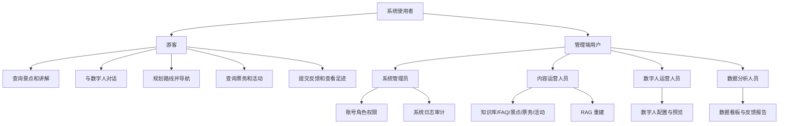

---

## 3. 需求分析

### 3.1 游客服务需求

游客端需求的核心来自景区游览的不确定性。游客进入景区后，通常同时面对空间不熟悉、信息不集中、时间有限和兴趣差异等问题。传统导览方式往往依赖固定地图、线下告示或人工咨询，这些方式对游客来说主动性较弱，且无法根据个人偏好动态调整。AI Guide 因此将游客需求拆解为信息查询、景点理解、路线规划、导航执行、周边发现、个性推荐和反馈评价几个部分。

在信息查询方面，游客希望能够以自然语言提问，例如“灵山大佛怎么走”“今天有什么演出”“门票多少钱”“适合老人游览的路线是什么”。系统不能只返回泛泛介绍，而应尽量依据景区知识库、FAQ、票务和活动配置给出准确答案。对于简单问题，FAQ 或关键词匹配即可解决；对于需要整合多条资料的问题，则需要通过 RAG 检索相关内容，再交由大模型生成更自然、更完整的回答。

在景点理解方面，游客不仅需要知道景点名称和位置，还希望了解景点的文化价值、开放信息、亮点和游览建议。因此景点详情页需要展示结构化信息，并支持语音讲解。语音讲解的作用不是重复文字，而是让游客在行走过程中也能获得内容服务。景点讲解还应和导航、附近景点、用户行为记录关联起来，形成“看景点、听讲解、去导航、留反馈”的完整链路。

在路线规划方面，游客之间差异较大。有的游客时间充裕，希望深度游览；有的游客只想走经典路线；有的游客带老人孩子，希望路线轻松；有的游客指定了必去景点。系统需要将这些输入转化为路线约束和评分条件，综合景点推荐顺序、停留时长、距离和兴趣标签生成候选路线。路线结果还应可解释，让游客知道为什么推荐这些点、预计花多久、路线亮点是什么。

在反馈与数据闭环方面，游客在使用路线、讲解、数字人问答等功能后，可以提交满意度评分、标签和评论。这些反馈不仅用于展示历史记录，也会进入管理端报告，用于发现低满意度服务、常见问题和运营改进方向。由此，游客端从单向展示转变为双向服务系统。

### 3.2 运营管理需求

管理端需求来自景区内容持续变化和运营决策的需要。景区信息不是一次录入后永久不变，票务价格、演出时间、活动地点、景点开放说明、FAQ 回答和数字人形象都可能调整。如果没有统一后台，内容会分散在多个渠道，更新困难且容易不一致。因此管理端首先需要提供统一的内容维护能力，将知识库、FAQ、景点、票务、活动和数字人配置纳入同一个系统。

知识库和 FAQ 管理承担 AI 问答的基础资料维护。知识库适合维护较长的说明性内容，FAQ 适合维护高频问答。景点管理承担空间与文化资料维护，票务和活动管理承担游客查询频率较高的运营信息维护。数字人配置则让运营人员能够不改代码就调整游客端数字人的名称、模型路径、音色和服装，并通过发布和回滚机制控制正式生效版本。

数据分析需求主要体现为管理端数据看板和反馈报告。景区运营人员需要知道系统服务了多少游客、游客问了哪些问题、哪些路线最常被使用、哪些景点最受关注、消费结构如何、满意度是否下降。系统通过游客交互表、路线历史表、行为记录表、反馈表和消费行为表进行聚合统计，并通过趋势对比和规则建议辅助运营判断。

权限和审计需求则来自后台管理的安全性。管理端包含内容发布、账号维护和数据查看等敏感操作，不同角色不应拥有同等权限。系统需要支持管理员账号、系统角色、自定义角色、权限勾选、账号停用、密码重置和操作日志。每一次关键写操作都应能够追溯到操作者、操作时间、资源对象和具体动作，避免后台出现无法解释的内容变化。

### 3.3 非功能需求

系统除了完成业务功能，还需要满足可用性、可维护性、安全性和可扩展性要求。可用性方面，AI、地图和语音服务都是外部依赖，不能假设它们永远稳定，因此系统应提供降级方案。例如大模型不可用时可返回规则模板或检索结果摘要，地图 API 不可用时可使用直线距离估算，TTS 不可用时可降级为文本或浏览器语音。可维护性方面，游客端、管理端、后端服务和算法服务应保持清晰边界，避免一个功能变化影响整个系统。安全性方面，管理端必须使用认证、权限和 CSRF 校验，并通过审计日志追踪写操作。可扩展性方面，系统应允许新增景点、新增角色、新增活动类型或替换 AI 模型，而不需要重写核心结构。

---

## 4. 功能设计

### 4.1 游客端功能设计

游客端的整体设计围绕“游览过程”展开，而不是按照后台数据表机械拆分。首页作为入口，负责把游客引导到 AI 数字人、景点讲解、路线规划、附近景点、票务助手、活动服务、个性化推荐和个人中心。AI 数字人承担自然语言入口，适合处理不确定问题；景点讲解承担深度内容展示，适合游客已经选定某个景点后的阅读和收听；路线规划承担行程安排，适合游客开始游览前或游览过程中调整计划；附近景点承担基于位置的即时发现；票务和活动承担高频运营信息查询；个人中心承担偏好、足迹、反馈等个性化内容沉淀。

AI 数字人问答模块的设计重点是让游客用自然语言进入服务。用户输入问题后，前端将消息发送给后端，后端记录会话并进行知识检索，然后根据意图和检索结果调用大模型生成回答。回答结果不仅包含文本，还可以携带业务动作，例如跳转景点详情、进入路线规划、打开票务助手等。数字人的模型、音色和服装来自管理端配置，因此运营人员可以在后台调整数字人形象，而无需修改游客端代码。

景点讲解模块围绕景点表和讲解资源表展开。每个景点包含名称、位置、经纬度、介绍、文化内涵、亮点、开放信息等字段，游客端展示时将这些字段组织为可读页面。语音讲解可以通过讲解资源表读取音频地址和讲解文本。如果音频生成失败或不存在，系统仍可展示文本介绍，保证景点内容可用。游客在景点详情页的浏览、导航、停留等行为会形成行为记录，为后续热度统计和推荐算法提供依据。

路线规划模块从用户角度看是一个表单和多个结果卡片，从系统角度看则是一个结合偏好、距离和时间预算的优化问题。用户可以设置游览时长、兴趣标签、出行方式、起点和必游景点。后端根据景点标签、官方顺序、建议停留时间和距离估算生成候选路线。路线规划不是只生成一条固定路线，而是尽量生成多条不同风格的候选结果，例如经典路线、轻松路线或偏好强化路线。前端对路线进行展示时，需要清晰说明总耗时、总距离、景点数量和推荐理由，使游客能够做出选择。

全程导航模块承接路线规划结果。系统将路线拆分为多个相邻路段，每个路段通过地图服务获取步行距离、耗时和路线指引。前端展示当前目标点、剩余站点和当前路段说明，并根据用户当前位置判断是否到达目标点。当游客接近当前景点时，系统自动切换到下一站；如果检测到偏离路线，可触发剩余路段重新规划。全程导航结束后，系统弹出反馈入口，将路线体验评价纳入反馈报告。

附近景点模块解决游客临场发现需求。系统以游客当前位置为中心，遍历景点坐标并计算距离，筛选一定范围内的景点后按距离排序。对于服务设施、餐饮住宿等非景点 POI，可结合本地缓存或地图周边服务获取。地图展示采用相对坐标映射，将经纬度差转换为页面位置，并对距离过近的点做聚合处理，避免地图标记重叠。

票务与活动模块强调信息准确性。票务信息由后台维护，包括票务名称、票种、适用人群、价格和官方说明。活动信息也由后台维护，包括活动类型、名称、地点、时间、时长、内容和文化意义。游客端只负责查询与展示，不处理支付、核销和订单。这种边界划分可以避免引入复杂交易风险，同时满足游客“查信息”的核心需求。

个性化推荐模块通过用户偏好和行为形成推荐结果。系统会根据用户选择、聊天关键词、浏览记录、导航行为和路线历史推断用户兴趣标签，再与景点标签进行匹配。推荐结果不仅排序，还会给出推荐理由，例如“与你的文化兴趣相关”“近期游客关注较多”“位于经典路线中”等，使推荐结果更容易被游客理解和接受。

个人中心模块用于承接长期使用数据。游览偏好以标签权重形式展示，帮助用户了解自己的兴趣画像；游览足迹根据用户导航过或访问过的景点生成，前端可将足迹点展示在地图上并按访问顺序连线。反馈页面则支持用户对整体应用或特定服务提交评分、标签和评论，并查看历史记录。

### 4.2 管理端功能设计

管理端功能设计遵循“数据对象清晰、操作流程统一、关键动作可审计”的原则。知识库、FAQ、景点、票务、活动等内容模块都采用类似的管理方式：列表查询、条件筛选、新增、编辑、删除和状态控制。这样可以降低运营人员学习成本，也便于前端形成统一页面结构。对于数字人配置、权限管理、系统日志和数据看板这类特殊模块，则在通用管理模式之上增加发布回滚、权限勾选、结构化日志解析和统计聚合等能力。

知识库管理用于维护 AI 问答的基础资料。知识库条目包含标题、正文和分类，运营人员可以按关键词和分类筛选，也可以新增、编辑或删除。知识库内容变化后，系统会清理检索缓存，避免游客端继续使用旧结果。如果需要使新内容进入语义检索链路，还需要触发 RAG 重建，将原始文本重新切分为知识块并生成向量。这里的设计体现了原始内容维护和检索索引维护的分离：运营人员维护的是可读文本，系统检索使用的是加工后的分块与向量。

FAQ 管理用于维护高频问答。FAQ 比知识库更结构化，包含问题、答案、分类、排序、启用状态和来源。启用状态决定该 FAQ 是否出现在游客端或参与 RAG 分块。这样做的好处是运营人员可以提前录入某些暂不生效的内容，也可以在信息过期时停用而不是立即删除。FAQ 同时服务于客服展示和 AI 问答，因此它在系统中既是前端内容，也是检索知识源。

景点管理是系统中复用程度最高的内容模块。景点数据用于景点列表、景点详情、附近景点、路线规划、导航、推荐和 RAG 问答。一个景点不仅包含名称和坐标，还包含介绍、文化内涵、亮点、开放信息、备注等内容。由于景点坐标会影响地图和路线，景点文字会影响讲解和问答，因此景点管理对整个系统的数据质量非常关键。

票务和活动管理用于维护时效性较强的运营信息。票务产品可以按类型区分门票、观光车票、联票或服务票，活动则可以按介绍、演出、体验等类型组织。两类数据都支持上下线，后台调整后游客端展示随之变化。系统不设计在线购票和核销，主要是因为真实交易需要支付、退款、库存、订单、票务核验等完整链路，而本项目重点是导览和信息服务。

数字人配置模块用于维护游客端数字人形象。每条配置包含名称、模型路径、音色、服装和是否生效。系统同一时间只允许一个配置生效，未生效配置可以作为历史版本。运营人员可以编辑配置、发布配置、回滚历史配置，也可以通过预览页面查看 Live2D 模型效果，并通过 TTS 试听音色。编辑当前生效配置时，系统会保存历史快照，避免误改后无法恢复。

数据看板和反馈报告承担运营分析职能。数据看板不是简单展示静态数字，而是从游客交互、路线历史、行为记录、反馈和消费数据中聚合指标。服务人次、会话数、互动次数、路线数、满意率、人均消费等核心指标能够帮助运营人员了解系统使用情况。热门问答、热门路线、关注点排行、消费结构和满意度分布则进一步展示游客关注内容和潜在问题。反馈报告聚焦游客评价，按日期筛选后展示满意度和评论，为服务改进提供直接依据。

权限管理和系统日志是管理端安全性的基础。权限管理支持管理员账号、角色策略和权限项维护。账号可以新增、编辑、停用和重置密码，角色可以使用系统角色或自定义角色，权限项按内容、分析、数字人、系统日志和账号管理等能力划分。系统日志则记录管理端关键操作，包括内容新增、编辑、删除、发布、下线、账号变更、角色变更和资源生成。日志采用结构化内容保存，因此页面可以展示操作对象、资源 ID、操作者和详情，而不是只有一段普通文本。

---

## 5. 总体方案设计

### 5.1 总体技术路线

AI Guide 采用前后端分离架构，并将游客端和管理端拆分为两个独立前端应用。游客端使用 Uni-app + Vue 3，便于适配 H5、小程序和 App；管理端使用 React + Vite，适合构建后台表单、表格和数据看板；后端以 FastAPI 为主，负责业务接口、AI 调度、RAG 检索、权限认证、地图服务封装和数据库访问。数据库使用关系型模型存储业务数据，便于进行内容维护、行为记录、统计分析和审计追踪。

系统总体技术思路可以理解为：前端只负责交互与展示，后端负责业务规则与能力编排，数据库负责持久化，AI 和地图作为外部能力被封装在服务层中。这样的分层可以避免游客端直接依赖复杂算法，也避免管理端直接操作数据库。所有数据变化都经过后端校验和审计，所有 AI 与地图调用都可以在后端统一增加缓存、降级和异常处理。

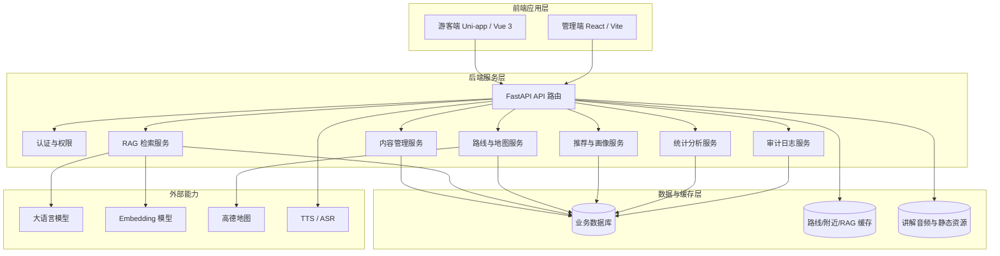

### 5.2 游客端方案

游客端的技术实现重点是移动端体验和业务流程衔接。页面并不是简单堆叠功能按钮，而是按照游客游览过程组织：进入首页后可以选择问答、景点、路线、附近、票务或个人中心；在景点详情中可以继续进入导航和附近服务；在路线规划结果中可以进入全程导航；导航结束后可以进入反馈。不同页面之间通过路由参数和后端返回数据连接，形成连续体验。

游客端所有核心数据都通过后端接口获取。景点详情来自景点表，讲解音频来自讲解资源，路线结果来自路线规划服务，附近景点来自坐标计算和缓存，推荐结果来自推荐服务，反馈提交写入反馈表。前端不直接实现复杂算法，而是把用户输入和当前位置传给后端，由后端结合数据库和外部服务计算结果。这样可以保证算法逻辑集中维护，也便于管理端数据变化后立即影响游客端。

### 5.3 管理端方案

管理端的技术实现重点是内容维护、状态管理和审计追踪。多数管理页面采用“表单区 + 查询区 + 列表区”的结构。新增时填写表单，编辑时将列表中的数据回填到表单，删除时进行确认，状态切换通过按钮完成。数字人配置、权限管理和数据看板属于复杂模块，分别增加了预览、发布回滚、权限勾选和数据统计展示。

管理端所有请求都经过认证和权限校验。登录后，系统根据管理员角色加载对应权限；每次访问管理接口时，后端会根据请求路径和方法判断所需权限。如果权限不足，则拒绝操作。对于新增、编辑、删除、发布、停用、重置密码等关键操作，系统会写入审计日志。这样既满足后台安全要求，也能为后续问题排查提供依据。

### 5.4 后端方案

后端方案的核心是服务分层。API 层负责接收请求、解析参数和返回结果；业务服务层负责处理知识检索、路线规划、推荐、统计分析等逻辑；数据层通过 ORM 模型访问数据库；外部服务层封装大模型、地图、TTS 和 Embedding 调用。每一层职责清晰，便于单独测试和维护。

在 AI 相关功能中，后端承担对话编排角色。它不是简单地把用户问题转发给大模型，而是先进行上下文组织、知识检索、意图识别和兜底处理，再调用大模型生成回答。在地图相关功能中，后端负责路线距离缓存和高德接口封装，避免前端重复调用外部 API。在管理端功能中，后端负责权限校验、数据校验和日志记录，保证后台操作可控。

### 5.5 AI 交互方案

AI 交互采用“检索优先、模型生成、规则兜底”的方案。对于景区问答，如果直接让大模型回答，容易出现信息不准确或编造内容的问题。因此系统先从知识库、FAQ 和景点资料中召回相关内容，再将这些内容作为参考资料传给大模型。大模型的职责是组织语言和形成自然回答，而不是凭空决定事实。对于明显的业务意图，如路线、票务、活动、导航等，系统还会返回对应业务动作，引导游客进入功能页面。

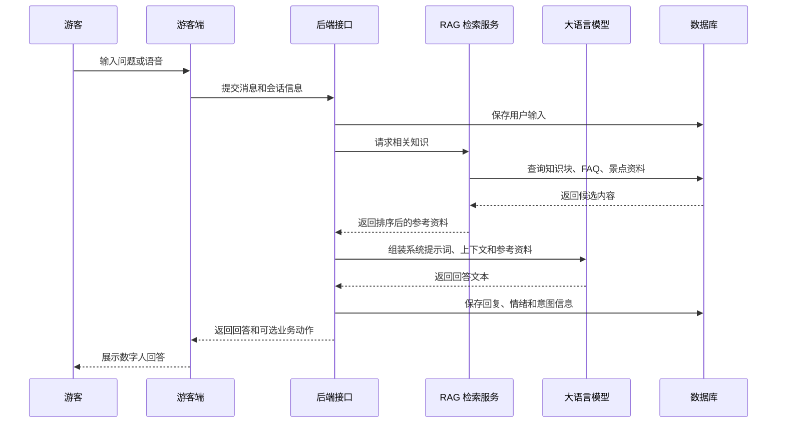

---

## 6. 数据库模型设计

### 6.1 数据模型设计思路

数据库设计围绕四类数据展开：第一类是基础内容数据，包括知识库、FAQ、景点、票务、活动和数字人配置；第二类是游客行为数据，包括对话记录、反馈、路线历史、路线分享和 App 行为；第三类是 AI 检索数据，包括知识分块和向量；第四类是管理安全数据，包括管理员账号、角色、会话和系统日志。这样的分类能够同时满足游客端展示、管理端维护、AI 检索和运营统计。

基础内容表通常由管理端维护，游客端读取。游客行为表通常由游客端触发写入，管理端统计分析。RAG 表由系统根据基础内容自动生成，不由运营人员手动编辑。权限与日志表由管理端认证和操作审计自动维护。通过这种设计，系统可以清楚地区分“原始内容”“加工数据”“行为记录”和“管理审计”。

### 6.2 ER 关系图

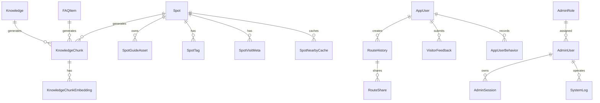

### 6.3 核心数据表说明

知识库表用于保存运营人员维护的景区知识条目，字段包括标题、正文、分类和更新时间。它是 RAG 的重要来源之一，适合保存较长的景区说明、服务说明或运营知识。FAQ 表用于保存结构化问答，包含问题、答案、分类、排序、启用状态和来源。FAQ 既可以直接用于客服式展示，也可以在启用后参与 RAG 分块。景点表保存景点名称、景区名称、位置、经纬度、建筑参数、核心功能、文化内涵、介绍、亮点和开放信息，是景点详情、附近景点、路线规划和问答检索的共同基础。

票务产品表保存票务名称、票务类型、适用人群、价格、官方提示和启用状态。活动表保存活动类型、名称、地点、经纬度、时间、时长、内容、意义和启用状态。数字人配置表保存名称、模型路径、音色、服装和是否生效。以上内容表都体现了管理端维护、游客端读取的模式，后台变更可以直接影响前端展示。

游客交互表记录游客与数字人的对话，包括游客 ID、会话 ID、输入内容、回复内容、情绪和创建时间。反馈表记录游客提交的评价，包括反馈类型、目标对象、目标名称、来源、标签、评论、满意度评分和情绪。路线历史表记录生成过的路线名称、路线类型、路线数据、总时长、总距离和景点数量。行为表记录游客在 App 内的浏览、搜索、导航、停留等行为。这些数据共同构成数据看板、推荐算法和反馈报告的数据基础。

管理员相关表包括管理员账号、管理员角色、管理员会话和系统日志。管理员账号保存用户名、密码哈希、显示名称、角色、启用状态和最近登录时间。角色表保存角色标识、角色名称、权限列表和是否系统角色。系统日志表保存日志级别、来源、结构化消息和创建时间，用于审计管理端所有关键操作。

### 6.4 RAG 数据模型说明

RAG 数据模型将原始内容和检索数据分离。知识库、FAQ 和景点是原始内容，知识块表是系统根据这些原始内容切分得到的检索单元，向量表则保存每个知识块在指定模型下计算出的 embedding。这样设计的原因是原始内容通常由人维护，适合阅读和编辑；知识块适合检索，通常需要包含来源、标题、内容片段和元数据；向量则适合语义相似度计算，可能随 embedding 模型变化而重建。

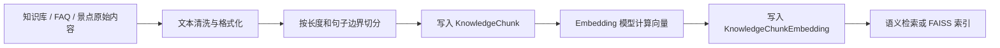

---

## 7. 前后端框架设计

### 7.1 游客端框架设计

游客端使用 Uni-app + Vue 3，主要考虑是移动端多平台适配。景区游客可能使用 H5、微信小程序或 App，因此前端框架需要具备跨端能力。游客端页面按业务功能拆分，包括首页、AI 对话、景点讲解、路线规划、路线详情、全程导航、附近景点、票务助手、活动服务、个性化推荐、反馈和个人中心。每个页面通过统一接口封装与后端通信，避免在页面中直接散落请求逻辑。

游客端的组件设计强调复用。地图展示、路线卡片、景点卡片、反馈弹窗、数字人展示和导航步骤都可以作为独立组件复用。状态管理主要用于保存用户信息、当前位置、当前路线、偏好标签和会话状态。对于定位、语音和系统导航等平台能力，前端需要做兼容封装，因为不同端的 API 能力可能存在差异。

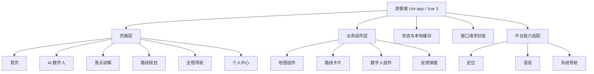

### 7.2 管理端框架设计

管理端使用 React + Vite，适合构建数据密集型后台。管理端页面以路由方式组织，每个页面对应一个业务模块。页面通常包含查询条件、编辑表单、列表表格和操作按钮。为了保持体验一致，知识库、FAQ、景点、票务、活动等页面采用类似交互模式；数字人配置增加预览和试听；权限管理增加账号和角色两套表单；系统日志增加筛选和结构化详情展示；数据看板则更侧重统计卡片、图表和导出。

管理端请求统一经过封装，自动携带认证令牌和必要的 CSRF 信息。用户登录后，前端保存当前管理员信息和权限列表，根据权限控制菜单展示和页面访问。即使前端隐藏了某些入口，后端仍会再次进行权限校验，保证安全边界不依赖前端。

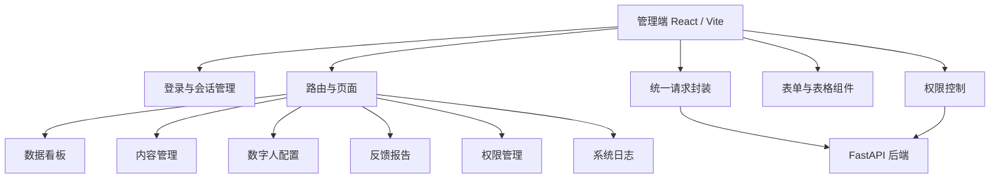

### 7.3 后端框架设计

后端使用 FastAPI，主要原因是它适合构建 REST API，类型提示清晰，便于自动生成接口文档，也适合与 Python 生态中的 AI、数据处理和向量检索工具结合。后端按路由模块划分游客端接口、管理端接口、认证接口、AI 接口、RAG 管理接口和数据分析接口。路由层只承担请求接入和基础校验，复杂逻辑放入服务层。

服务层按能力拆分，包括知识检索服务、分块服务、embedding 服务、FAISS 索引服务、路线规划服务、推荐服务、讲解资源服务、统计分析服务和认证服务。数据库模型由 ORM 定义，业务服务通过数据库会话操作数据。这样的设计使得某个能力需要替换时，例如从关键词检索切换到向量检索、从一个大模型切换到另一个大模型，不需要改变游客端或管理端页面结构。

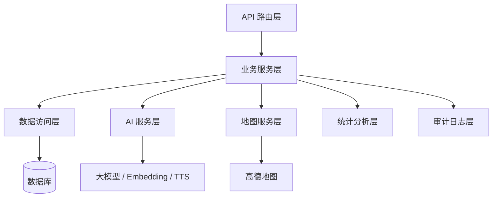

---

## 8. 核心算法与 AI 交互设计

### 8.1 RAG 检索增强生成

RAG 是系统 AI 问答准确性的关键。普通大模型虽然语言能力强，但如果没有景区真实资料作为约束，容易回答不准确或生成不存在的信息。因此系统采用检索增强生成流程：先将知识库、FAQ 和景点资料切分成知识块，在用户提问时先检索相关知识块，再将检索结果作为参考资料传给大模型。大模型只负责组织语言和整合信息，事实依据优先来自系统知识库。

RAG 重建指的是当知识库、FAQ 或景点内容发生变化后，系统重新生成检索数据的过程。它通常包括同步分块、计算向量和构建索引。同步分块会读取原始数据并按长度和句子边界切成知识块；计算向量会使用 embedding 模型为每个知识块生成语义向量；构建索引则用于提高向量检索速度。这样做的意义在于保持问答内容和后台维护内容一致。如果只修改原始知识而不重建检索数据，语义检索可能仍然命中旧内容。

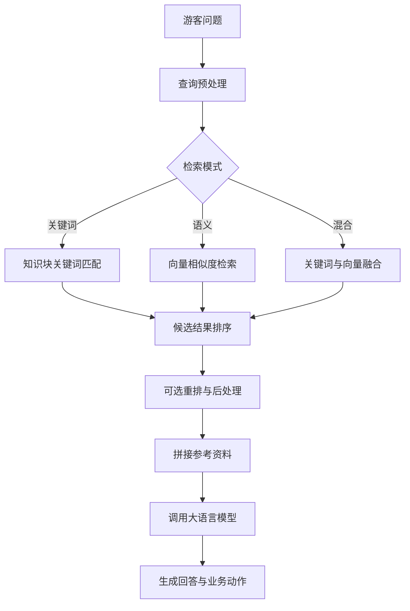

### 8.2 路线规划算法

路线规划算法本质上是在有限时间和空间距离约束下选择景点并排序。系统首先根据用户输入确定约束条件，包括起点、游览时长、兴趣标签、必游景点和出行方式。必游景点会被强制加入路线，其他景点则根据标签匹配、关键词命中、官方顺序、景点热度和是否适合作为休息点等因素打分。系统会在评分较高的景点中选择候选点，再计算景点之间的距离和预计耗时。

排序阶段根据点位数量选择不同策略。当景点数量较少时，可以枚举不同访问顺序，比较总距离和总耗时，找到更优顺序；当景点数量较多时，枚举成本过高，系统使用贪心最近邻策略，即每一步选择距离近且优先级高的下一个景点。为了生成多条候选路线，系统会对已被前一条路线使用的景点加入多样性扣分，使后续路线在保持合理性的同时尽量有所差异。最终排序时，系统优先展示不超出时间预算的路线，其次比较总耗时、景点数量和路线亮点。

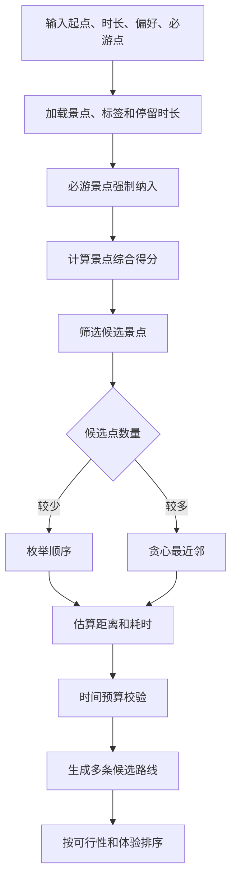

### 8.3 个性化推荐算法

个性化推荐采用标签画像和行为增强结合的方式。系统首先维护景点标签，例如文化、建筑、亲子、休闲、祈福、湖景等。用户画像来自两个方面：一是用户显式选择的偏好，二是系统从聊天内容、搜索、浏览、导航和路线历史中推断出的兴趣。每个标签都会形成一个权重，权重越高说明用户对该类型内容越感兴趣。

对景点进行推荐时，系统将用户标签画像与景点标签进行匹配，再叠加景点热度、官方顺序和必游属性。如果用户没有历史行为，系统会采用冷启动策略，优先推荐官方顺序靠前、必游标识明显或全站热度较高的景点。推荐结果会附带理由，这一点对景区系统很重要，因为游客更愿意接受“因为你关注禅意文化，所以推荐梵宫”这样的解释，而不是只看到一个排序结果。

### 8.4 数据看板统计与营销建议

数据看板的算法主要是多表聚合和规则分析。服务人次通常通过不同业务表中的 visitor_id 去重获得，会话数通过 session_id 去重获得，互动次数直接统计游客交互记录，路线数统计路线历史记录，满意率根据反馈评分大于等于 4 的占比计算。热门问答会对游客问题文本进行聚合，热门路线会解析路线数据中的景点顺序，并将相同顺序视为同一路线签名。

营销建议不是调用大模型随意生成，而是基于规则从统计结果中提取运营线索。例如，如果某个景点在关注点排行中持续靠前，可以建议加强该景点讲解内容或周边服务引导；如果某类问题在热门问答中频繁出现，说明游客对该信息不够清楚，可以建议在首页或 FAQ 中前置；如果满意度下降且低分反馈集中在导航或路线，可以建议检查路线规划和地图指引体验。这样的规则建议虽然不复杂，但具有可解释性，适合作为运营人员的辅助判断。

---

## 9. 安全与权限设计

管理端采用认证、授权和审计三层安全设计。认证用于确认操作者身份，授权用于确认该操作者是否有权访问某个功能，审计用于在操作完成后留下可追溯记录。系统登录后使用访问令牌进行接口鉴权，同时通过刷新令牌维持会话。写操作配合 CSRF 校验，避免跨站请求风险。管理员密码以哈希形式保存，不保存明文。

权限模型采用 RBAC。管理员账号绑定角色，角色拥有权限列表。系统内置系统管理员、内容运营、数据分析、数字人运营等角色，同时支持自定义角色。权限项按业务领域划分，例如内容查看、内容维护、数据分析查看、数字人查看、数字人维护、系统日志查看、账号和角色管理等。接口访问时，后端根据请求路径和方法判断所需权限，再与当前管理员角色权限匹配。即使前端隐藏了菜单，后端也会执行最终权限校验。

审计日志记录管理端关键操作，包括知识库、FAQ、景点、票务、活动、数字人配置、账号、角色和讲解资源等模块的新增、修改、删除、发布、下线、重置密码和资源生成。日志内容采用结构化 JSON 保存，包含动作、资源类型、资源 ID、资源名称、操作者和详情。这样系统日志页面可以将日志解析为可读字段，方便追踪“谁在什么时候改了什么”。

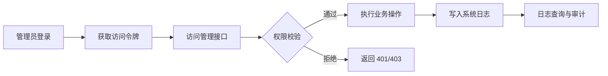

---

## 10. 测试说明

### 10.1 测试目标

测试工作的目标是验证系统在功能正确性、数据一致性、算法可靠性、安全边界和异常降级方面满足设计要求。由于 AI Guide 同时包含游客端、管理端、后端服务、数据库、AI 能力和地图能力，测试不能只停留在页面点击层面，而应覆盖从前端交互到后端落库、从算法输入到结果输出、从权限配置到接口访问控制的完整链路。

对于游客端，测试重点是核心游览流程是否可连续完成。用户应能从首页进入 AI 问答，查询景点后进入详情，生成路线后进入导航，导航结束后提交反馈，并在个人中心看到相关足迹或记录。对于管理端，测试重点是内容维护是否影响游客端展示，权限是否正确限制访问，日志是否记录关键操作，数据看板是否能按日期范围正确统计。对于 AI 和算法能力，测试重点是 RAG 能否命中正确知识，路线规划是否包含必游点，推荐结果是否与偏好相关，外部服务异常时是否能降级。

### 10.2 测试范围与方法

单元测试主要覆盖不依赖完整运行环境的函数和服务，例如文本分块、评分计算、路线排序、权限判断、统计指标计算等。接口测试用于验证 REST API 的参数校验、状态码、返回结构和数据库写入。集成测试用于验证多个模块协作，例如游客提交反馈后管理端报告是否能查询到，知识库更新后是否清理缓存，管理员停用账号后会话是否失效。前端测试则关注页面是否能正确渲染、表单是否能提交、按钮状态是否正确、错误提示是否清晰。

安全测试重点验证未登录访问、无权限访问、CSRF 缺失、账号停用、密码重置后的旧会话失效等场景。降级测试则模拟外部 AI、地图或 TTS 服务不可用的情况，观察系统是否返回可理解的提示或兜底结果。对于路线规划和推荐算法，还需要准备固定输入数据，验证算法输出是否稳定、可解释并符合业务约束。

### 10.3 核心测试场景

游客端测试覆盖首页入口跳转、AI 问答、景点详情、讲解播放、路线生成、路线详情、全程导航、附近景点、票务活动、反馈提交和个人中心展示。管理端测试覆盖登录、刷新、退出、知识库 CRUD、FAQ 启停、景点维护、票务活动上下线、数字人发布回滚、权限管理、密码重置、系统日志筛选和数据看板统计。算法测试覆盖 RAG 分块、关键词检索、语义检索降级、路线必游点约束、时间预算约束、多候选路线差异和推荐理由生成。

验收时重点检查三条主链路。第一条是游客服务链路：游客能够提问、查看景点、规划路线、导航并反馈。第二条是运营维护链路：管理员能够维护内容，并看到内容在游客端或 AI 检索中生效。第三条是安全审计链路：不同角色权限不同，关键操作会写入日志，并可按日期、来源和级别查询。

---

## 11. 部署与运维说明

系统部署时应至少包含游客端静态资源、管理端静态资源、FastAPI 后端服务、数据库和静态资源目录。如果需要完整 AI 能力，还需要配置大模型接口、Embedding 模型、TTS/ASR 服务和地图 Key。

运维重点包括数据库备份、RAG 重建状态监控、外部服务可用性监控、日志审计和管理员账号管理。内容更新后应关注检索缓存是否清理，必要时触发 RAG 重建。地图、AI 和 TTS 服务不可用时，应检查降级逻辑是否生效。系统日志应定期查看，尤其关注账号权限变更、内容删除、数字人发布和资源生成等高风险操作。

---

## 12. 总结

AI Guide 的设计重点是将游客端体验和管理端运营连接起来。游客端解决“如何获取信息、如何规划路线、如何理解景点、如何完成导航、如何留下反馈”的问题，管理端解决“内容如何维护、AI 知识如何更新、运营数据如何分析、权限如何控制、操作如何追溯”的问题。系统通过 RAG、路线规划、推荐算法、数字人配置、数据看板和审计日志形成完整闭环，使它不仅是一个可演示的智慧导览应用，也具备继续扩展为真实景区服务平台的基础。
